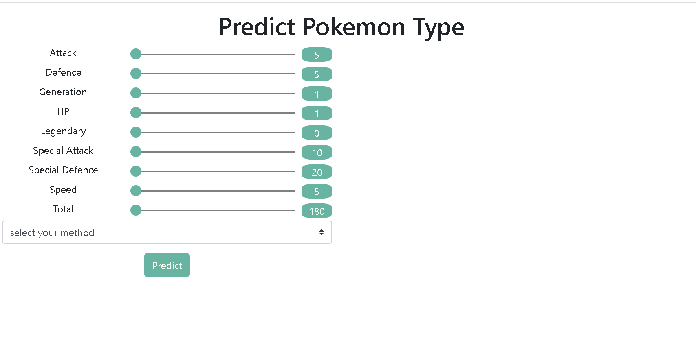

# pokemonapp

A simple web app built with `Flash`, `JQuery` and `d3.js` which allows user to predict a pokemon's type based on its features (models built using `scikit-learn`).  

### Step 1: Building classifiers 

- For details see `model.ipynb`

### Step 2: Build the web-app

- Tested on Google Chrome ver. 79, Firefox ver. 72 and Microsoft Edge ver. 44, screen_record performed on Google Chrome
- Custom range slider currently doesn't displayed correct on IE, it's working correctly though 

### Step 3: Deployment 

- TODO 

### Improvements:

- Add option to combine 3 models (i.e., an ensemble model)
- Add pop-up info (i.e., feature definition, data source, model overview etc.,)
- Refactor the app to use `Flask` + `Vue.js` 

### Data source

- https://www.kaggle.com/abcsds/pokemon
